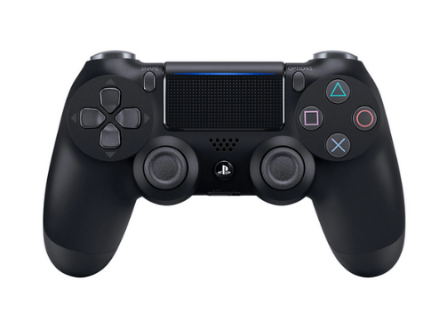

# About
A package to suit your non-blocking PS4 interface

## PS4 Views
<div align="center">


LED View of the PS4



Top View of the PS4

</div>

# Usage
1. Connect your controller to Bluetooth.
For the first time connecting, Hold the share button, then hold the PlayStation Button. The lights on the controller will blink rapidly. Open your bluetooth settings to add the device.
2. Check which interfaces you have available at `/dev/input` via `ls /dev/input/ | grep js` command.
The terminal will list all input paths that starts with `js`.
When you connect a new device, there should be a entry and it usually starts at `js0`. The more controllers/joysticks are connected the more `jsN` interfaces you will see.
So if you have only one controller/joystick connected, you should only see 1 interface: `/dev/input/js0`,
take a note of it as we will need it in next step.
3. Copy the code below into a Python file, lets say `main.py`
    ```python
        import asyncio
        from AsynchronousPS4Controller import Controller

        controller = Controller(path="/dev/input/js0")

        # you can start listening before controller is paired, as long as you pair it within the timeout window
        asyncio.run(controller.listen(timeout=30))
    ```
4. Now run that file like so `python main.py` and use your controller.
You will see output on your screen based on the input to your controller.
You can bind your own logic to each one of those events.
Lets say you want print "Hello world" on X press and "Goodbye world" on X release then the code would look like this:
    ```python
    import asyncio
    from AsynchronousPS4Controller import Controller

    class MyController(Controller):
        def __init__(self, **kwargs):
            Controller.__init__(self, **kwargs)

        async def on_x_press(self):
            print("Hello world")

        async def on_x_release(self):
            print("Goodbye world")


    controller = MyController(path="/dev/input/js0", debug = True)

    # you can start listening before controller is paired, as long as you pair it within the timeout window
    asyncio.run(controller.listen(timeout=30))
    # you can start listening before controller is paired, as long as you pair it within the timeout window
    asyncio.run(controller.listen(timeout=30))
    ```

    Here is a list of all the events you can override in a similar manner:
    ```py
    on_x_press
    on_x_release
    on_triangle_press
    on_triangle_release
    on_circle_press
    on_circle_release
    on_square_press
    on_square_release
    on_L1_press
    on_L1_release
    on_L2_press
    on_L2_release
    on_R1_press
    on_R1_release
    on_R2_press
    on_R2_release
    on_up_arrow_press
    on_up_down_arrow_release
    on_down_arrow_press
    on_left_arrow_press
    on_left_right_arrow_release
    on_right_arrow_press
    on_L3_up
    on_L3_down
    on_L3_left
    on_L3_right
    on_L3_x_at_rest  # Left joystick goes back to x-axis after moving
    on_L3_y_at_rest  # Left joystick goes back to y-axis after moving
    on_L3_press  # Left joystick is clicked.
    on_L3_release  # Left joystick is released after the click.
    on_R3_up
    on_R3_down
    on_R3_left
    on_R3_right
    on_R3_x_at_rest  # Right joystick goes back to x-axis after moving
    on_R3_y_at_rest  # Right joystick goes back to y-axis after moving
    on_R3_press  # Right joystick button is clicked.
    on_R3_release  # Right joystick button is released after the click.
    on_options_press
    on_options_release
    on_share_press
    on_share_release
    on_playstation_button_press
    on_playstation_button_release
    ```

# Registering Callbacks
It is possible to bound callbacks to the `listen` function.
Three call back functions can be registered: `on_connect` , `on_disconnect` and `on_timeout`
Here is an example how to do it.
```python
import asyncio
from AsynchronousPS4Controller import Controller

def connect():
    # any code you want to run during initial connection with the controller
    pass

def disconnect():
    # any code you want to run during loss of connection with the controller or keyboard interrupt
    pass

def timeout():
    # any code you want to run during timeout of controller before exit with code 1
    pass

class MyController(Controller):

    def __init__(self, **kwargs):
        Controller.__init__(self, **kwargs)


controller = MyController(interface="/dev/input/js0", connecting_using_ds4drv=False)
asyncio.run(controller.listen(timeout=30,connect_callback=connect, disconnect_callback=disconnect,timeout_callback=timeout))
```

# Known limitations at this time
- Mouse pad events and clicks are not detected (This is due to it works through `/dev/input/mouseN` or `/dev/input/mice` and uses a different way to unpack)
- Sensor information (accelerometers and/or gyro) is not detected (This is due to it works through `/dev/input/eventN` and uses a different way to unpack)
