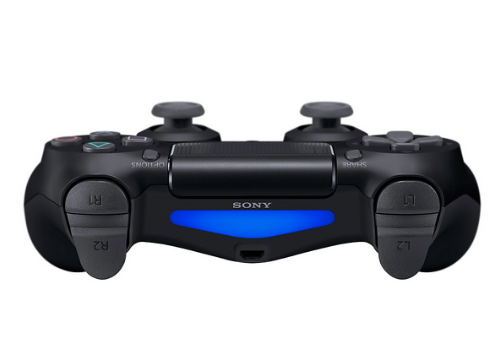
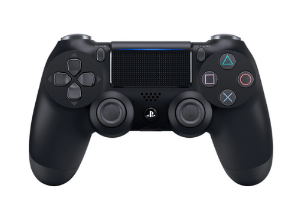

# PS4 Views
## LED View of the PS4
The view where L1, L2, R1, R2 buttons are located.
???+ note
    The L2 buttons and R2 buttons are analog buttons so their callback is slightly different

## Top View of PS4
???+ note
    The joysticks are called L3 and R3 based on PS4 own convention.
???+ note
    The arrow buttons comes in pairs when it is untriggered it is unable to be differentiated. So the callbacks are `on_up_down_arrow_release` and `on_left_right_arrow_release` respectively

